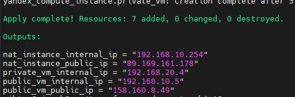
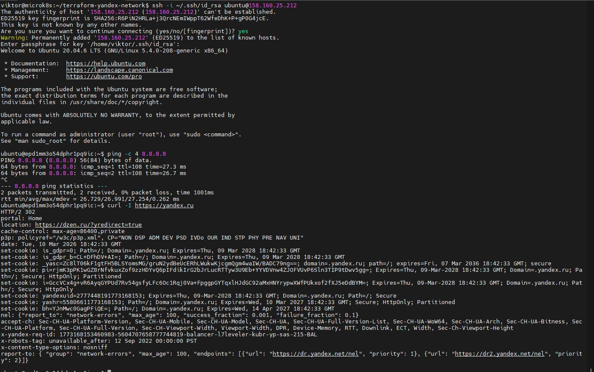
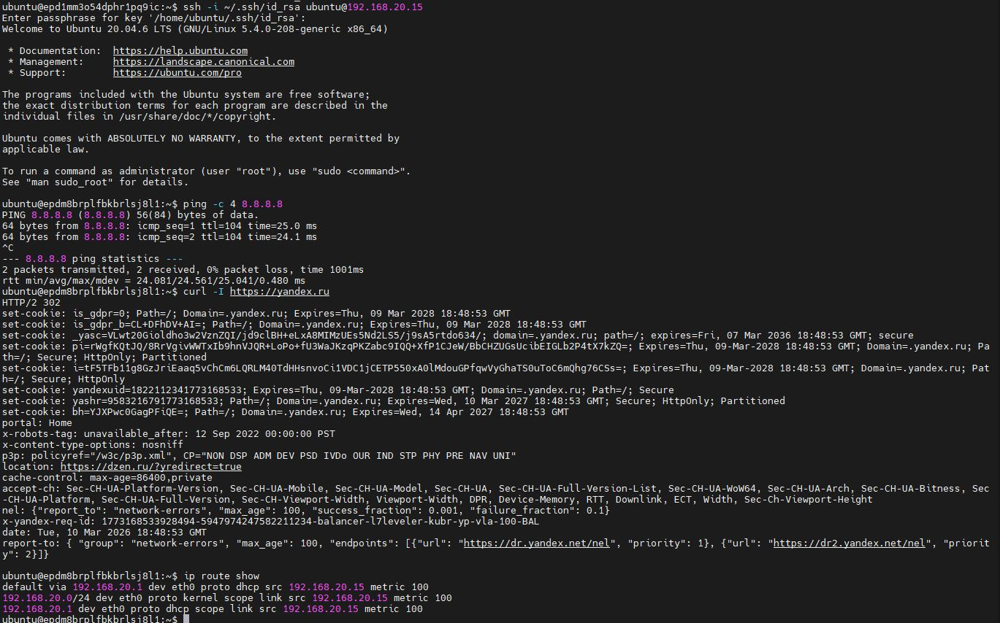
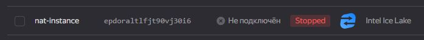
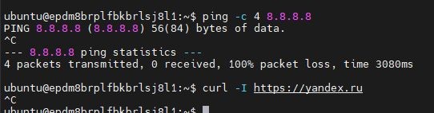
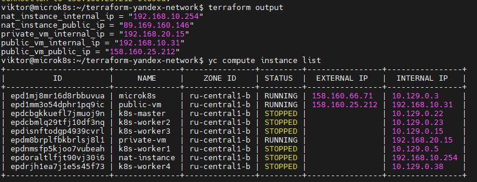

# Домашнее задание к занятию «Организация сети» - Лебедев В.В. FOPS-33

### Подготовка к выполнению задания

1. Домашнее задание состоит из обязательной части, которую нужно выполнить на провайдере Yandex Cloud, и дополнительной части в AWS (выполняется по желанию). 
2. Все домашние задания в блоке 15 связаны друг с другом и в конце представляют пример законченной инфраструктуры.  
3. Все задания нужно выполнить с помощью Terraform. Результатом выполненного домашнего задания будет код в репозитории. 
4. Перед началом работы настройте доступ к облачным ресурсам из Terraform, используя материалы прошлых лекций и домашнее задание по теме «Облачные провайдеры и синтаксис Terraform». Заранее выберите регион (в случае AWS) и зону.

---
### Задание 1. Yandex Cloud 

**Что нужно сделать**

1. Создать пустую VPC. Выбрать зону.
2. Публичная подсеть.

 - Создать в VPC subnet с названием public, сетью 192.168.10.0/24.
 - Создать в этой подсети NAT-инстанс, присвоив ему адрес 192.168.10.254. В качестве image_id использовать fd80mrhj8fl2oe87o4e1.
 - Создать в этой публичной подсети виртуалку с публичным IP, подключиться к ней и убедиться, что есть доступ к интернету.
3. Приватная подсеть.
 - Создать в VPC subnet с названием private, сетью 192.168.20.0/24.
 - Создать route table. Добавить статический маршрут, направляющий весь исходящий трафик private сети в NAT-инстанс.
 - Создать в этой приватной подсети виртуалку с внутренним IP, подключиться к ней через виртуалку, созданную ранее, и убедиться, что есть доступ к интернету.

Resource Terraform для Yandex Cloud:

- [VPC subnet](https://registry.terraform.io/providers/yandex-cloud/yandex/latest/docs/resources/vpc_subnet).
- [Route table](https://registry.terraform.io/providers/yandex-cloud/yandex/latest/docs/resources/vpc_route_table).
- [Compute Instance](https://registry.terraform.io/providers/yandex-cloud/yandex/latest/docs/resources/compute_instance).

---

### Решение 1

Конфигурируем провайдера

[main.tf](https://github.com/ViktorLebedev93/orgnet-15.1hw/blob/main/main.tf)

```
terraform {
  required_version = ">= 0.13"
  required_providers {
    yandex = {
      source = "yandex-cloud/yandex"
    }
  }
}

provider "yandex" {
  token     = var.yc_token
  cloud_id  = var.yc_cloud_id
  folder_id = var.yc_folder_id
  zone      = var.default_zone
}
```

Определяем переменные

[variables.tf](https://github.com/ViktorLebedev93/orgnet-15.1hw/blob/main/variables.tf)

```
variable "yc_token" {
  type        = string
  sensitive   = true
  description = "Yandex Cloud OAuth token"
}

variable "yc_cloud_id" {
  type        = string
  description = "Yandex Cloud ID"
}

variable "yc_folder_id" {
  type        = string
  description = "Yandex Cloud Folder ID"
}

variable "default_zone" {
  type        = string
  default     = "ru-central1-b"
  description = "Default zone"
}

variable "vpc_name" {
  type        = string
  default     = "my-vpc"
  description = "VPC network name"
}

variable "public_subnet" {
  type        = string
  default     = "public"
  description = "Public subnet name"
}

variable "public_cidr" {
  type        = list(string)
  default     = ["192.168.10.0/24"]
  description = "Public subnet CIDR"
}

variable "private_subnet" {
  type        = string
  default     = "private"
  description = "Private subnet name"
}

variable "private_cidr" {
  type        = list(string)
  default     = ["192.168.20.0/24"]
  description = "Private subnet CIDR"
}

variable "nat_image_id" {
  type        = string
  default     = "fd80mrhj8fl2oe87o4e1"
  description = "NAT instance image ID"
}

variable "ubuntu_image_id" {
  type        = string
  default     = "fd84h56p8ucfgqroscfv"
  description = "Ubuntu 20.04 image ID"
}

variable "nat_instance_ip" {
  type        = string
  default     = "192.168.10.254"
  description = "NAT instance internal IP"
}
```

Создадим VPC

[network.tf](https://github.com/ViktorLebedev93/orgnet-15.1hw/blob/main/network.tf)

```
resource "yandex_vpc_network" "my_vpc" {
  name = var.vpc_name
}

# Публичная подсеть
resource "yandex_vpc_subnet" "public" {
  name           = var.public_subnet
  zone           = var.default_zone
  network_id     = yandex_vpc_network.my_vpc.id
  v4_cidr_blocks = var.public_cidr
}

# Приватная подсеть
resource "yandex_vpc_subnet" "private" {
  name           = var.private_subnet
  zone           = var.default_zone
  network_id     = yandex_vpc_network.my_vpc.id
  v4_cidr_blocks = var.private_cidr
  route_table_id = yandex_vpc_route_table.private_route.id
}

# Route table для приватной подсети
resource "yandex_vpc_route_table" "private_route" {
  name       = "private-route"
  network_id = yandex_vpc_network.my_vpc.id
  
  static_route {
    destination_prefix = "0.0.0.0/0"
    next_hop_address   = var.nat_instance_ip
  }
}
```

Создадим NAT-инстанс с фиксированным IP 192.168.10.254

[nat_instance.tf](https://github.com/ViktorLebedev93/orgnet-15.1hw/blob/main/nat_instance.tf)

```
resource "yandex_compute_instance" "nat_instance" {
  name        = "nat-instance"
  platform_id = "standard-v3"
  zone        = var.default_zone

  resources {
    cores  = 2
    memory = 2
  }

  boot_disk {
    initialize_params {
      image_id = var.nat_image_id
      size     = 20
    }
  }

  network_interface {
    subnet_id  = yandex_vpc_subnet.public.id
    ip_address = var.nat_instance_ip
    nat        = true
  }

  metadata = {
    ssh-keys = "ubuntu:${file("~/.ssh/id_rsa.pub")}"
  }
}
```

Создадим тестовую ВМ в публичной подсети (с публичным IP)

[public.tf](https://github.com/ViktorLebedev93/orgnet-15.1hw/blob/main/public.tf)

```
resource "yandex_compute_instance" "public_vm" {
  name        = "public-vm"
  platform_id = "standard-v3"
  zone        = var.default_zone

  resources {
    cores  = 2
    memory = 2
  }

  boot_disk {
    initialize_params {
      image_id = var.ubuntu_image_id
      size     = 20
    }
  }

  network_interface {
    subnet_id = yandex_vpc_subnet.public.id
    nat       = true
  }

  metadata = {
    ssh-keys = "ubuntu:${file("~/.ssh/id_rsa.pub")}"
  }
}
```

Создадим тестовую ВМ в приватной подсети (только внутренний IP)

[private.tf](https://github.com/ViktorLebedev93/orgnet-15.1hw/blob/main/private.tf)

```
resource "yandex_compute_instance" "private_vm" {
  name        = "private-vm"
  platform_id = "standard-v3"
  zone        = var.default_zone

  resources {
    cores  = 2
    memory = 2
  }

  boot_disk {
    initialize_params {
      image_id = var.ubuntu_image_id
      size     = 20
    }
  }

  network_interface {
    subnet_id = yandex_vpc_subnet.private.id
    nat       = false
  }

  metadata = {
    ssh-keys = "ubuntu:${file("~/.ssh/id_rsa.pub")}"
  }
}
```

Создадим вывод

[outputs.tf](https://github.com/ViktorLebedev93/orgnet-15.1hw/blob/main/outputs.tf)

```
output "nat_instance_public_ip" {
  description = "Public IP of NAT instance"
  value       = yandex_compute_instance.nat_instance.network_interface[0].nat_ip_address
}

output "public_vm_public_ip" {
  description = "Public IP of test VM in public subnet"
  value       = yandex_compute_instance.public_vm.network_interface[0].nat_ip_address
}

output "public_vm_internal_ip" {
  description = "Internal IP of test VM in public subnet"
  value       = yandex_compute_instance.public_vm.network_interface[0].ip_address
}

output "private_vm_internal_ip" {
  description = "Internal IP of test VM in private subnet"
  value       = yandex_compute_instance.private_vm.network_interface[0].ip_address
}

output "nat_instance_internal_ip" {
  description = "Internal IP of NAT instance"
  value       = yandex_compute_instance.nat_instance.network_interface[0].ip_address
}
```

Ресурсы созданы



Подключаемся к публичной ВМ и проверяем в ней работу интернета



Подключаемся с публичной машины к приватной и проверяем работу интернета в ней



Погасил NAT инстанс



Интернет на приватной ВМ перестал работать



В ходе задачи мы создали public-vm , private-vm и nat-instance
Так же output вывод созданного Terraform



---

Resource Terraform:

1. [VPC](https://registry.terraform.io/providers/hashicorp/aws/latest/docs/resources/vpc).
1. [Subnet](https://registry.terraform.io/providers/hashicorp/aws/latest/docs/resources/subnet).
1. [Internet Gateway](https://registry.terraform.io/providers/hashicorp/aws/latest/docs/resources/internet_gateway).

### Правила приёма работы

Домашняя работа оформляется в своём Git репозитории в файле README.md. Выполненное домашнее задание пришлите ссылкой на .md-файл в вашем репозитории.
Файл README.md должен содержать скриншоты вывода необходимых команд, а также скриншоты результатов.
Репозиторий должен содержать тексты манифестов или ссылки на них в файле README.md.
